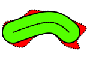

# COVER

A utility library for collision checking of polygonal footprints.

## Contents

The library provides a collection of classes and functions for collision
checking of polygonal footprints.

The base functionality is implemented in the "generators.hpp" file:
A set of generators which will yield the cells on a ray, on the outline or
inside an area.

These cells can be used to check the collision freedom of a specific pose or
configuration - the functions for these checks are implemented in "costmap.hpp".

The functionality of these two files is similar as provided by the popular
ros-navigation libraries
[costmap_2d]([link](http://wiki.ros.org/costmap_2d/layered)), 
[base_local_planner](http://wiki.ros.org/base_local_planner) or
[nav_grid_iterators](https://github.com/locusrobotics/robot_navigation/tree/noetic/nav_grid_iterators)

Additionally the library allows the user to exploit the information generated
by the commonly used
[InflationLayer](http://wiki.ros.org/costmap_2d/layered#Inflation_Layer).
The functionality provided in the "footprints.hpp" allows the user to split the
footprint into two types of sub-regions:
 - The first region type is always inside the inflated region. The collision
   check this type can be done by just querying the cells which roughly lie on
   the
   [topological skeleton](https://en.wikipedia.org/wiki/Topological_skeleton)
   of the region.
 - The second region type is the "remainder" - here we must check all cells
   inside the region.



Have a look at the potato above.
The red shape shows the entire polygon.
The green area shows the first region type.
There its sufficient to check for inscribed costs **on** the dashed line.
The cells inside the red areas one needs to check all cells.

However, the splitting of the polygon is relatively time-consuming and may
not make sense of all use-cases.
The current benchmarks are liked [here](doc/benchmark.md).

## Compilation

If you want to build the benchmark target, pass -DCOVER_BENCHMARK=ON to the
cmake:

```
catkin build cover --no-deps --cmake-args -DCOVER_BENCHMARK=ON
```

If you want to build the doxygen documentation, pass -DCOVER_DOXYGEN=ON to the cmake.
Additionally  you can enable the clang-tidy and include-what-you-use (IWYU) checks.
But both checks are not recommended currently.
